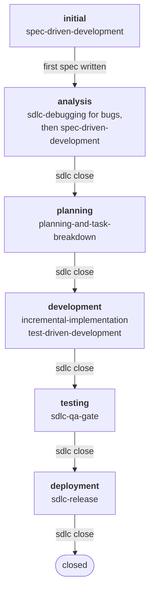

# SDLC-Assist

An agent skill, `sdlc`, that works out which phase of the software development life cycle a work request is in, shows the evidence, asks one confirmation, and points to the skill that does the next step.

It reads the repo (spec headers, the cycle's `plan.md` and `tasks.md`, read-only git queries) and never blocks a transition. Three own phase skills (sdlc-debugging, sdlc-qa-gate, sdlc-release) and five skills from `addyosmani/agent-skills` (the spec-driven-development family) are bundled so the recommendations work out of the box.

## Who this is for

A developer, or a small team, already working with a coding agent (Claude Code, OpenCode, Codex, Cursor) on a repository that receives mixed requests: bugs, customer complaints, features, ideas, production alerts. You want the agent to frame the work before it codes, and to treat a complaint the same way every time, without adopting a whole methodology or restructuring the repo.

It is not an orchestrator and not a team of role-playing agents. It never blocks a transition, never runs a state-changing git command, and writes nothing into your repo beyond spec headers. If you want an agent that runs the whole cycle by itself, this is not it.

How it sits next to the tools you may already have:

| Tool | What it does | What `sdlc` adds |
|---|---|---|
| [Superpowers](https://github.com/obra/superpowers) | A full method: brainstorm, plan, TDD, subagents, review | Tells you which phase you are in from what the repo already contains, then recommends Superpowers' skills when they are installed |
| [BMAD Method](https://github.com/bmad-code-org/BMAD-METHOD) | Agile roles (PM, architect, dev, QA) and 50+ workflows | One question instead of a ceremony; no roles, no new folders |
| [Spec Kit](https://github.com/github/spec-kit) | Specify, plan, tasks, implement, with its own CLI and templates | Works on specs you already have, whatever wrote them, and knows when a request is a hotfix or a complaint rather than a feature |
| Standalone spec skills (`write-tech-spec`, `tlc-spec-driven`, ...) | Write one spec well | The routing around the spec: what enters, when it is approved, what closes each phase, what to do after the release |

The router does not replace any of these. It reads the repo, asks one question, and hands off to whichever of them you have installed.

In the usual taxonomy of spec-driven development (spec-first: the spec is written before the code and may rot afterwards; spec-anchored: the spec is kept and updated to steer the code; spec-as-source: only the spec is edited and the code is generated from it), this router is **spec-anchored**: the spec stays the record of decisions, its `Phase:`/`Status:` header advances through close mode, and every behavior change starts in it, while the code is still written by people and agents. What it adds over a spec-first toolkit is that it infers which step you are on from what the repository already contains, and asks, instead of assuming you know.

| Slug | Phase | Recommended skill |
|---|---|---|
| `initial` | Initial planning | spec-driven-development |
| `analysis` | Requirements analysis | spec-driven-development; sdlc-debugging on the bug route |
| `planning` | Planning | planning-and-task-breakdown |
| `development` | Development | incremental-implementation, test-driven-development |
| `testing` | Testing | sdlc-qa-gate (alternative: qa-push) |
| `deployment` | Deployment | sdlc-release (alternative: release-engineer) |

## Quickstart

```bash
cd ~ && npx skills add PapiScholz/SDLC-Assist -y
```

Then open any repo with your agent and describe the work, or say "where are we". The router answers with the inferred phase, the evidence, and one question. Confirm the phase and follow the skill it names. When the phase's artifact exists, say "sdlc close". Other install paths (Claude Code plugin, manual copy, OpenCode command) are in Install below.



Where each kind of request enters the cycle, and what the router does on every request, are drawn in [`docs/sdlc-flow.md`](docs/sdlc-flow.md).

## Install

| Path | Command | Skill by intent | Explicit command | Notes |
|---|---|---|---|---|
| skills.sh | `cd ~ && npx skills add PapiScholz/SDLC-Assist` | Claude Code, OpenCode, Codex, Cursor | none | Installs the nine skills (router + three own + five vendored) with all files. `--skill sdlc` (or `-s sdlc`) installs only the router. Overwrites same-named skills in `~/.agents/skills`. |
| Claude Code plugin | `claude plugin marketplace add PapiScholz/SDLC-Assist` then `claude plugin install sdlc-assist@papischolz` | Claude Code | `/sdlc-assist:phase` | Also registers the three own and five vendored skills. Duplicates with user-scope copies are reported by `which.js --verbose`. |
| Manual | `cp -r plugins/sdlc-assist/skills/* ~/.claude/skills/` | Claude Code, OpenCode | `/sdlc` (user-scope) | Copies all nine skills. |
| OpenCode command | `cp .opencode/command/sdlc-phase.md ~/.config/opencode/command/` | (any of the above) | `/sdlc-phase` | Manual step on every path. |

Run the skills.sh command from `~`, not from inside a project: the CLI installs into the current directory's scope when it finds a repo there. The CLI copies each skill folder whole and links it into `~/.claude/skills`, `~/.codex/skills`, `~/.cursor/skills` and `~/.config/opencode/skills`.

Codex and Cursor get the skill by intent only in v1; native command files for them are on the roadmap.

Overwrite and duplicate notes:

- skills.sh overwrites same-named skills already in `~/.agents/skills`. Back up local edits first.
- Installing both the plugin and a user-scope copy registers the same skill twice. Keep one; `which.js --verbose` lists the duplicates (without `--verbose` the JSON has `duplicates: []` and `duplicatesOmitted: true`). Run it from where the skill is installed: `node ~/.agents/skills/sdlc/bin/which.js --verbose` (skills.sh), `node "${CLAUDE_PLUGIN_ROOT}/skills/sdlc/bin/which.js" --verbose` (plugin), or `node ~/.claude/skills/sdlc/bin/which.js --verbose` (manual copy).
- Find other skills with `npx skills find <term>`.
- This checkout ships Claude Code hooks (git authorization, LF/no-BOM guard) in `.claude/settings.json`; they do not travel with the installed skills. See Playbook mapping.

## How to use

A cycle is one spec file whose header carries the phase: `docs/specs/<date>-<slug>/spec.md` with `plan.md` and `tasks.md` beside it, or a legacy flat spec (`docs/specs/*.md`, root `spec.md` or `SPEC-*.md`) paired with `tasks/plan.md` and `tasks/todo.md`. The router reads that header, the cycle's plan and task list, the project constitution when there is one, and read-only git queries, and never blocks a transition. Diagrams of the cycle, the entry points and the per-request protocol: [`docs/sdlc-flow.md`](docs/sdlc-flow.md).

0. **Day one (optional): constitution, architecture, repo hygiene.** `docs/constitution.md` (or root `CONSTITUTION.md`) holds the rules every spec, plan and change obeys; `ARCHITECTURE.md` is the current shape of the repo (template in `plugins/sdlc-assist/skills/sdlc/references/architecture-template.md`); the nine hygiene files (`LICENSE`, `README.md`, `CONTRIBUTING.md`, `SECURITY.md`, `CODE_OF_CONDUCT.md`, `.gitignore`, `.gitattributes`, `.editorconfig`, `ARCHITECTURE.md`) are listed when missing, in `initial` and before a first release only (`references/repo-hygiene.md`). The router detects all three, cites them, and never writes them. Constitution: template in `plugins/sdlc-assist/skills/sdlc/references/constitution-template.md`. The router reports it as `signals.constitution` and every phase sheet cites it; without one it says nothing.
1. **Describe the work.** A new idea, a bug, a complaint someone else reported, a feature, a hotfix. The router writes your text to a temp file, runs `where.js`, and asks one question: `Phase: <inferred>`, up to three evidence lines, warnings, options. Confirm or pick an alternative. A complaint first goes through the request card (who asks, what happens, expected, where, urgency); the router asks for any missing line.
2. **Write the spec** with the skill the router names (`spec-driven-development`; `sdlc-debugging` first on the bug route). A `## Decisions` bullet that amends a principle, adds or removes a technology or changes a public contract gets `[ADR]` and its own file in `docs/adr/` (`references/adr-template.md`). Right after the H1:

   ```
   Phase: analysis
   Status: draft
   ```

   Specs always start in `analysis`; `initial` ends when the first spec exists. Slugs are the six in the table above; `Status` is `draft`, `approved` or `closed`. Details: `plugins/sdlc-assist/skills/sdlc/references/spec-header.md`.
3. **Close each phase** when its artifact exists: say "sdlc close" (or `/sdlc-assist:phase close`). The router infers the phase, asks whether it is finished and what it produced, and advances the header from the phase you confirm:

   | Confirmed phase | Writes |
   |---|---|
   | initial | nothing |
   | analysis | `Status: approved`, `Phase: planning` |
   | planning | `Phase: development` |
   | development | `Phase: testing` |
   | testing | `Phase: deployment` |
   | deployment | `Phase: deployment`, `Status: closed` |

   It edits only the active spec; with no spec it writes nothing and says so. It never touches the CHANGELOG and never runs state-changing git commands.
4. **Plan, build, test, release** with the recommended skill of each phase: `planning-and-task-breakdown` writes the cycle's `plan.md` and `tasks.md` (legacy: `tasks/plan.md`, `tasks/todo.md`); `incremental-implementation` and `test-driven-development` carry development; `sdlc-qa-gate` reports what was verified and the residual risk; `sdlc-release` bumps, tags and publishes only when you ask in that turn.
5. **Close the cycle.** After the tag, "sdlc close" writes `Status: closed`. A production signal (alert, finding, monitoring ticket) re-enters through `plugins/sdlc-assist/skills/sdlc/references/maintain.md`, which writes an intent and opens a new cycle in `analysis`. A hotfix under the threshold (typo or doc fix, or at most 20 lines in 2 files with no new dependency) enters at `development` with no spec and leaves no trace.

Commands: `/sdlc-assist:phase` (plugin), `/sdlc` (user-scope skill), `/sdlc-phase` (OpenCode). Add `close` to run close mode. Entry rules by request type are in `plugins/sdlc-assist/skills/sdlc/references/entry-points.md`.

### What the router sees

A real run on a scratch repo (two source files, `CHANGELOG.md` with `## [1.2.0]`, tag `v1.2.0` on HEAD, no spec), with the request "customer complains about X":

```
$ node plugins/sdlc-assist/skills/sdlc/bin/where.js --root <scratch repo> --message-file <temp file>
```

Output, trimmed to the keys the router reads:

```json
{
  "inferred": "analysis",
  "evidence": [
    "fallback: analysis (candidates: analysis)",
    "tests not run (no --run-tests)",
    "in production: tag v1.2.0"
  ],
  "alternatives": [],
  "warnings": [],
  "request": { "message": "customer complains about X", "type": "complaint" }
}
```

The agent turns that into one question (`Phase: analysis`, the evidence lines, `Warnings: none`, `Options: [confirm analysis]`; no `new cycle` option because there is no active cycle). `inProduction` adds the note "keep the running version safe".

The same run on a repo with a folder cycle (`docs/specs/2026-10-01-x/spec.md` with `Phase: development` / `Status: approved`, `plan.md` and `tasks.md` beside it with two open tasks), trimmed to the cycle keys:

```json
{
  "active": { "path": "docs/specs/2026-10-01-x/spec.md", "phase": "development", "status": "approved" },
  "signals": {
    "plan": { "exists": true, "path": "docs/specs/2026-10-01-x/plan.md" },
    "todo": { "exists": true, "path": "docs/specs/2026-10-01-x/tasks.md", "open": 2, "done": 0, "total": 2 }
  },
  "inferred": "development",
  "evidence": [
    "header Phase: development, Status: approved (docs/specs/2026-10-01-x/spec.md)",
    "fallback: development (candidates: development)",
    "tests not run (no --run-tests)"
  ],
  "warnings": []
}
```

The plan and the task list are the files beside that spec; a flat spec keeps `tasks/plan.md` and `tasks/todo.md`, and a folder under `docs/specs/` without `spec.md` is not a cycle.

## Missing-skill protocol

If none of a phase's recommended skills (or alternatives) is installed, the router asks one extra question: install a known one (only when the install table in `missing-skill.md` has a verified command for it), search (`npx skills find <term>` or the `find-skills` skill), create it along the way, or continue without it. Continuing is announced once and never blocks. See `plugins/sdlc-assist/skills/sdlc/references/missing-skill.md`.

## Playbook mapping

How the router maps to the six stages of the AI-native SDLC playbook (`#sd-c2`):

| Stage | Here | Artifact that ends it |
|---|---|---|
| Plan | `initial`, or an `intent.md` for an idea on existing code (`references/intent.md`). An intent is for an idea or a feature the originator brings; a feature someone else reports as a request goes through the request card | committed `intent.md` |
| Design | `analysis` (spec, with `Intent:` when one exists; request card for bugs) | spec with `Status: approved` |
| Build | `planning` then `development` | the cycle's `plan.md`, then the merged PR |
| Test | `testing` (`sdlc-qa-gate`) | the gate report and `Phase: deployment` |
| Deploy | `deployment` (`sdlc-release`) | tag and release |
| Maintain | entry point `references/maintain.md` | a new `intent.md` |

Every sheet carries `Governance:` (what git records) and `Measure:` (one leading, one lagging indicator). Left out on purpose, as the user's infrastructure: the automatic Maintain loop with control bands, evals in CI, AI review with `REVIEW.md`, `.claude/agents/` definitions, scheduled security scans.

This repo's own hooks (`.claude/settings.json`: git authorization from the user's last message, LF/no-BOM guard) apply to Claude Code sessions in this checkout; other hosts rely on CI. The git-authorization hook gates the `Bash` and `PowerShell` tools. It catches careless or lagging commands (wrong verb, stale transcript, wrappers such as `sudo`/`env`/`timeout`/`xargs`, `bash -c`, `pwsh -Command`, `cmd /c`, `eval`/`iex`, substitutions, brace expansion, heredocs) and denies any command word built from `$`, backticks or `{a,b}` when a gated subcommand follows; it does not scan `xargs -I {}` arguments, heredoc bodies fed to `sh`, or `Start-Process git -ArgumentList ...`; a `pwsh -EncodedCommand` line is denied outright; parse ambiguity resolves to a deny. Sessions whose transcript carries no human records (SDK, headless) are denied every gated operation. Set `SDLC_HOOKS_DISABLE=1` in your shell to turn them off.

## Own skills

Written for this repo, generic, English, Markdown only (stack detection stays in `where.js`).

| Skill | Phase | Produces |
|---|---|---|
| `sdlc-debugging` | analysis, bug route | `Cause:` and `Evidence:` lines for the short spec; reproduce, localise, explain, hand off; never edits product code |
| `sdlc-qa-gate` | testing | the `Layer / Verified / Not verified / Residual risk` table plus gaps; never a "green" verdict |
| `sdlc-release` | deployment | version decision, version files and changelog, tag and release; drives an existing release mechanism; every state-changing command only on request |

Section parity with their contracts is enforced by `node plugins/sdlc-assist/skills/sdlc/bin/check-skill-sections.js`.

## Bundled skills

Vendored unmodified from `https://github.com/addyosmani/agent-skills` at commit `bc97fd46fdb294dc3518d0e94edb989a38894f31`, MIT license. Each folder has a `VENDORED.md`; refresh with `node plugins/sdlc-assist/skills/sdlc/bin/sync-vendored.js --fix`.

| Skill | Upstream path |
|---|---|
| spec-driven-development | `plugins/sdlc-assist/skills/spec-driven-development` |
| planning-and-task-breakdown | `plugins/sdlc-assist/skills/planning-and-task-breakdown` |
| incremental-implementation | `plugins/sdlc-assist/skills/incremental-implementation` |
| test-driven-development | `plugins/sdlc-assist/skills/test-driven-development` |
| context-engineering | `plugins/sdlc-assist/skills/context-engineering` |

## Development

Node 20 or newer, no dependencies. One command runs the same gates CI runs (`--quick` skips the network-bound `sync-vendored --check`; the list is in `CONTRIBUTING.md`):

```
bash scripts/gates.sh
```

`node plugins/sdlc-assist/skills/sdlc/bin/where.self-test.js` runs the ten phase-inference fixtures alone. To try the folder-cycle fixture the CI install-smoke job runs, build it by hand: `git init` a scratch repo, write `docs/specs/2026-10-01-x/spec.md` (`Phase: development`, `Status: approved`), `plan.md` and `tasks.md` with two open boxes beside it, commit, and run `where.js --root <scratch>`; `inferred` is `development` and `signals.todo.path` is the folder's `tasks.md`. Red CI runs and the dogfood record are in `docs/ci-red-runs.md`. Listing channels, the directory pre-submission checks and the portal steps are in [`docs/distribution.md`](docs/distribution.md).

## Roadmap

v1.5 shipped as v0.6.0, v0.7.0 and v0.8.0 (spec `docs/specs/2026-09-30-v1-5-sdd-alignment.md`, closed): acceptance criteria in EARS with a warn-only check, `## Clarifications` with a close rule for analysis, one plan and one task list per cycle (`docs/specs/<date>-<slug>/{spec,plan,tasks}.md`), and a project constitution the router detects and the phase sheets cite. Deferred: native command files for Codex and Cursor once their formats are verified; tie-break of two cycles with the same effective date (see the spec's `## Decisions`).

v1.6 shipped as v0.9.0, v0.10.0 and v0.11.0 (spec `docs/specs/2026-10-01-v1-6-repo-artifacts/spec.md`, closed): three read-only signals the router detects and the phase sheets cite, never writes and never nags about: ADRs in `docs/adr/` with an advisory `check-adr.js` (v0.9.0), `ARCHITECTURE.md` (v0.10.0), and a closed list of repo hygiene files mentioned in `initial` and `deployment` only (v0.11.0). It is the first cycle on the per-cycle folder layout.

## Security

Automated skill scanners rate this skill as medium risk because it tells the agent to run scripts. The scripts only read the analysed repository, run read-only git queries, and never install or execute anything on their own; the project's test suite runs only behind an explicit flag. `SECURITY.md` lists exactly what each script touches, the trust boundaries of each install path, and how to report a vulnerability privately. The repository holds no credentials of its own: the only tokens it references are GitHub Actions secrets that `release.yml` uses to publish releases, they never ship with the installed plugin, and nothing in the skills reads them at runtime. `sync-vendored.js` clones a public repository over HTTPS with no credential, and `docs/ci-red-runs.md` is a log of pasted commands, not code that runs on install.

The installed skills need only Node and the agent: the rules (never commit, never install, never block, write only spec headers) are instructions in `SKILL.md`, not hooks or guards that ship with it. Your own hooks and guards reinforce them; they are not required.

## Contributing

Contributions are welcome. `CONTRIBUTING.md` describes what the repository accepts, the local validation loop (the same gates CI runs on Ubuntu and Windows), and the spec-first rule: behavior changes start in `docs/specs/`. Vendored skills are not edited here; propose changes upstream. By participating you agree to `CODE_OF_CONDUCT.md`.

## License

MIT, see `LICENSE`. Vendored skills keep their upstream MIT license.
