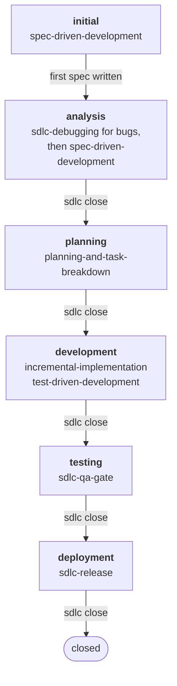
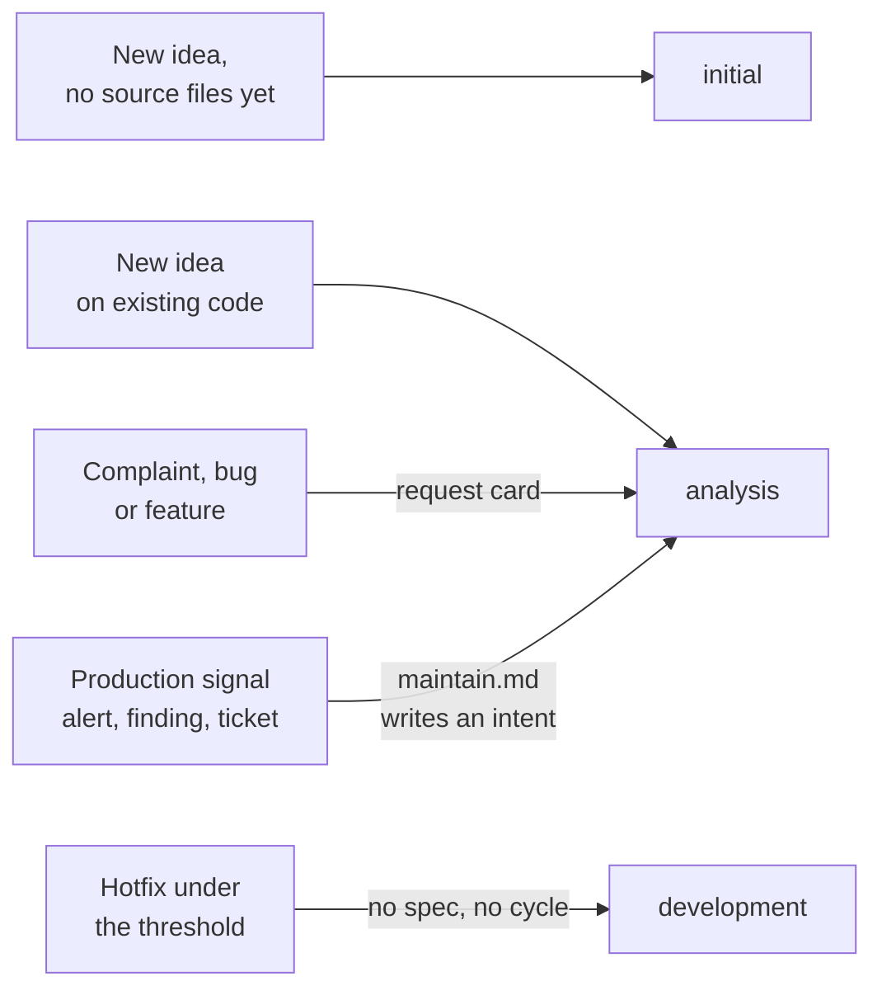
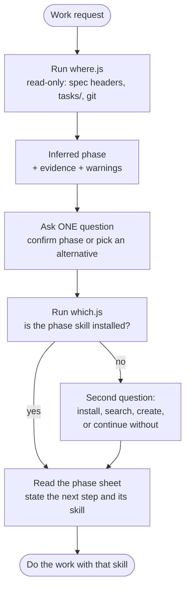

# How the sdlc skill works

Three small diagrams: the phase cycle, where each kind of request enters it, and what the agent does on every request. Details live in `plugins/sdlc-assist/skills/sdlc/SKILL.md` and `plugins/sdlc-assist/skills/sdlc/references/`.

## 1. The cycle

One cycle is one spec file with a `Phase:` / `Status:` header. Each phase has one recommended skill. Only close mode (`sdlc close`) moves the header.

What each close writes into the spec header:

| Close confirmed in | Header becomes |
|---|---|
| initial | nothing: the first spec already says `analysis` |
| analysis | `Status: approved`, `Phase: planning` |
| planning | `Phase: development` |
| development | `Phase: testing` |
| testing | `Phase: deployment` |
| deployment | `Status: closed` |

## 2. Where a request enters

- **Request card** (five lines): who asks, what happens, expected, where, urgency. The agent asks for any missing line and never invents one.
- **Hotfix threshold**: unambiguous and self-contained, and either a typo or doc fix or at most 20 lines in at most 2 files with no new dependency. Anything else goes to `analysis`.
- **Production signals** never skip the loop: `maintain.md` turns the signal into an `intent.md`, then a new cycle opens in `analysis`.

## 3. What the agent does on every request

Rules that hold throughout:

- Warnings never block. Development without an approved spec, or deployment without testing, become warning lines inside the question.
- Tests run only when the user asks in the current turn; otherwise the evidence says `tests not run`.
- The skill writes only spec files created through the SDD flow and header updates on a confirmed close. It never runs a state-changing git command and never releases on its own.
- One planned cycle at a time: `tasks/plan.md` and `tasks/todo.md` are shared, so a new cycle waits for the active one to close or for the user to switch.

## Day to day

1. Install once: `npx skills add PapiScholz/SDLC-Assist -y`, or the Claude Code plugin.
2. Describe the work, or say "where are we". Answer the one question.
3. Follow the recommended skill. New specs get the header right under the H1.
4. When the phase's artifact exists, say "sdlc close". Repeat until `Status: closed`.
